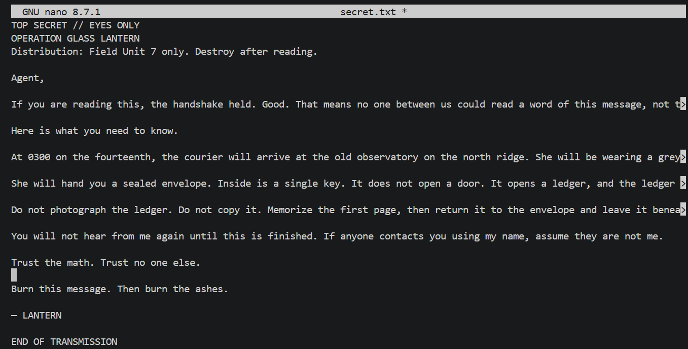
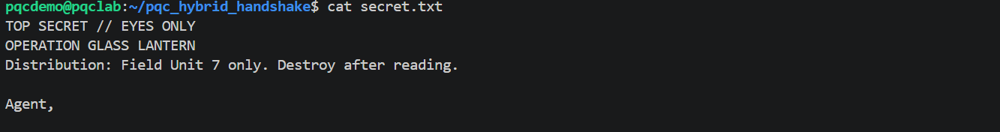
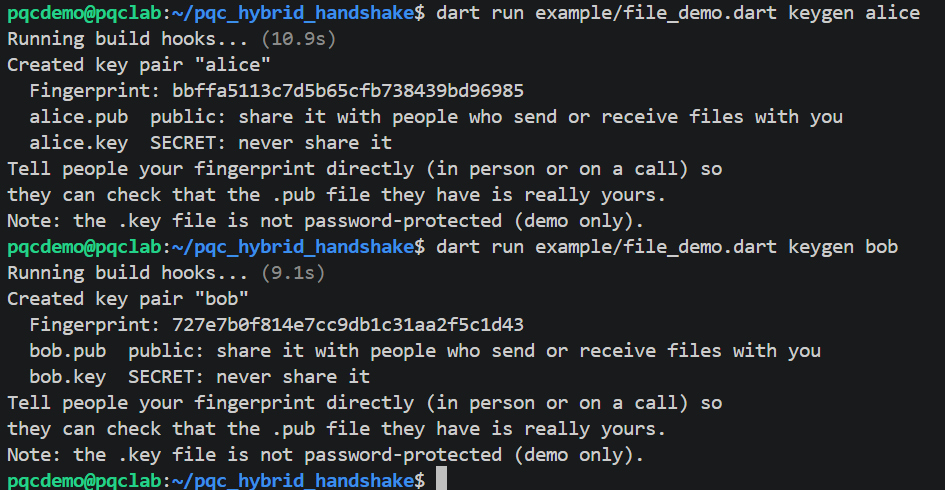
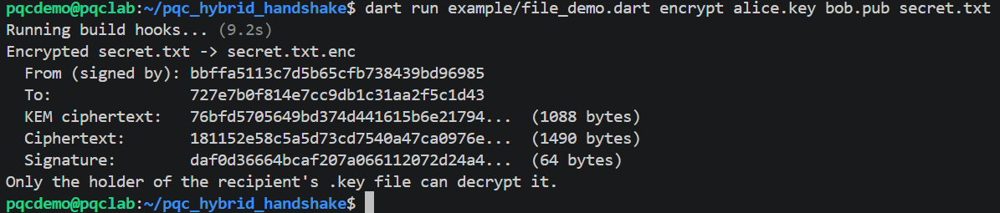
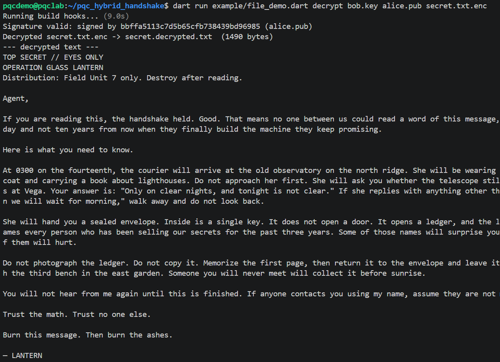
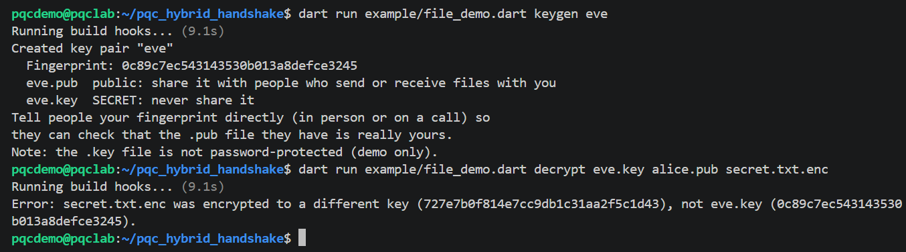
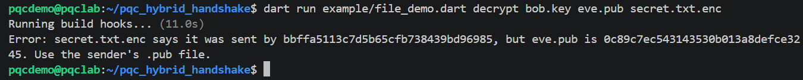
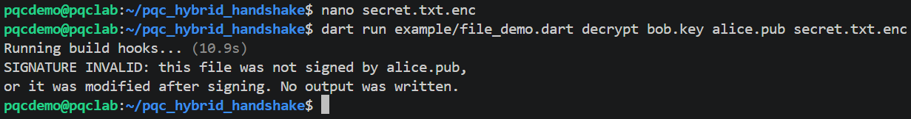

# pqc_hybrid_handshake

A small Dart package implementing a **PQXDH-style hybrid key agreement**:
one X25519 exchange plus one ML-KEM-768 encapsulation, bound to a
length-prefixed handshake transcript and combined with chained
HKDF-Extract steps into a 32-byte root key.

It is extracted from the key exchange in **Cryptaverse**, a privacy-first
end-to-end encrypted messaging app, and kept byte-for-byte compatible with
it. The protocol labels (`cryptaverse-pqxdh-v1`, `cryptaverse-root-v1`) are
therefore unchanged.

> **Status:** not independently audited. This package implements the
> key-exchange step: two parties derive the same 32-byte secret key, which
> is then used to encrypt data with an authenticated cipher.
> [`example/encrypt_demo.dart`](example/encrypt_demo.dart) shows the full
> path from key generation to an encrypted and decrypted message.

## API

| Function | Purpose |
| --- | --- |
| `x25519GenerateKeyPair()` | Fresh X25519 key pair (raw bytes) |
| `x25519SharedSecret(ourPriv, ourPub, theirPub)` | 32-byte X25519 shared secret |
| `mlkemGenerateKeyPair()` | Fresh ML-KEM-768 key pair (1184-byte public, 2400-byte secret) |
| `mlkemEncapsulate(recipientPub)` | Returns `(sharedSecret, ciphertext)` (32 / 1088 bytes) |
| `mlkemDecapsulate(ciphertext, secretKey)` | Returns the 32-byte shared secret |
| `buildTranscript(...)` | Length-prefixed transcript of both parties' public material |
| `deriveHybridRoot(ssDH:, ssKEM:, transcript:)` | 32-byte hybrid root key |
| `encodeB64url` / `decodeB64url` | Canonical unpadded base64url used in the transcript |

The functions are pure: no storage, networking, or platform code.

## Demo

```bash
dart run example/encrypt_demo.dart
dart run example/encrypt_demo.dart "your own message"
dart run example/encrypt_demo.dart --file notes.txt
```

It prints every step: both parties' keys, the ML-KEM ciphertext, the
X25519 and ML-KEM shared secrets on each side, the transcript, the matching
root keys, the encrypted message (nonce, ciphertext, authentication tag),
the decrypted result, and a tampered ciphertext being rejected.

The encryption step derives a message key from the root key with
HKDF-SHA256 and encrypts with ChaCha20-Poly1305. It illustrates how a root
key is used; it is not part of the package API, and a real messenger needs
more (for example, fresh keys per message).

## File encryption demo

`example/file_demo.dart` encrypts a file to a recipient, signs it, and
decrypts it in a separate run. The walkthrough below uses Alice (sender),
Bob (recipient), and Eve (someone who shouldn't get in).

### Quick start

Requires Linux or macOS (on Windows, use WSL2; see
[Running the tests](#running-the-tests)).

```bash
git clone https://github.com/cz003op/pqc_hybrid_handshake.git
cd pqc_hybrid_handshake
dart pub get
```

Run every command below from inside the `pqc_hybrid_handshake` folder.

### 1. Write a message

```bash
nano secret.txt
```



Save with **Ctrl+O**, then **Enter**, and exit with **Ctrl+X**. Check it:

```bash
cat secret.txt
```



### 2. Create key pairs for Alice and Bob

```bash
dart run example/file_demo.dart keygen alice
dart run example/file_demo.dart keygen bob
```



Each person gets a `.pub` file (public, safe to share) and a `.key` file
(secret, never shared). The fingerprint is how people check that a `.pub`
file really belongs to who they think it does.

### 3. Alice encrypts the message to Bob and signs it

```bash
dart run example/file_demo.dart encrypt alice.key bob.pub secret.txt
```



This writes `secret.txt.enc`. Alice needs only her own `.key` and Bob's
`.pub`; no secret is shared between them beforehand.

### 4. Bob verifies and decrypts it

```bash
dart run example/file_demo.dart decrypt bob.key alice.pub secret.txt.enc
```



The signature is checked first, then the file is decrypted to
`secret.decrypted.txt`.

### 5. What it refuses to do

**Eve can't read a file meant for Bob.** Her key doesn't match the
recipient the file was encrypted to:

```bash
dart run example/file_demo.dart keygen eve
dart run example/file_demo.dart decrypt eve.key alice.pub secret.txt.enc
```



**Bob can't be fooled about who sent it.** The file is from Alice, so
checking it against Eve's public key fails:

```bash
dart run example/file_demo.dart decrypt bob.key eve.pub secret.txt.enc
```



**A modified file is rejected.** Delete the earlier output, open
`secret.txt.enc`, change any one character in the `"ciphertext"` value,
save, and decrypt again:

```bash
rm secret.decrypted.txt
nano secret.txt.enc
dart run example/file_demo.dart decrypt bob.key alice.pub secret.txt.enc
```



### How it works

Each key pair has X25519 and ML-KEM-768 keys for receiving files and an
Ed25519 key for signing files you send. To encrypt, the sender creates
one-time X25519 and ML-KEM-768 keys, runs the handshake against the
recipient's public keys (with the sender's fingerprint in the transcript),
derives a file key with HKDF-SHA256, encrypts with ChaCha20-Poly1305, and
signs the result with Ed25519. To decrypt, the recipient checks the
signature against the sender's `.pub` file, then repeats the handshake.

A valid signature proves the file came from whoever holds the sender's
`.key` file. It does not prove the `.pub` file you were given belongs to
that person; compare fingerprints with them directly.

This is a demo: key files are not password-protected, the file format is
specific to this example, Ed25519 is not post-quantum (ML-DSA would be the
post-quantum replacement), and none of it has been audited. For real
secrets use an established tool such as [age](https://age-encryption.org).

## Installation

This package is not on pub.dev. Add it from GitHub in your `pubspec.yaml`:

```yaml
dependencies:
  pqc_hybrid_handshake:
    git:
      url: https://github.com/cz003op/pqc_hybrid_handshake.git
      ref: v0.1.0
```

Then run `dart pub get` (or `flutter pub get`) and import it:

```dart
import 'package:pqc_hybrid_handshake/pqc_hybrid_handshake.dart';
```

## Protocol

Two roles: the **encapsulator** and the **decapsulator**. Both have an X25519
key pair and an ML-KEM-768 key pair, and both already know each other's
public keys and fingerprints. (In Cryptaverse the role is decided
deterministically by comparing fingerprints; any rule works as long as both
sides agree.)

1. The encapsulator runs ML-KEM-768 `Encaps` against the decapsulator's
   ML-KEM public key, getting `ssKEM` and a ciphertext `ct`, and sends `ct`.
2. The decapsulator runs `Decaps(ct)` with its ML-KEM secret key to recover
   `ssKEM`.
3. Each side computes `ssDH = X25519(own private key, peer public key)`.
4. Each side builds the same transcript and derives the root key:

```text
temp1 = HMAC-SHA256(key = 0x00 * 32, msg = ssDH)       // HKDF-Extract
temp2 = HMAC-SHA256(key = temp1,     msg = ssKEM)      // HKDF-Extract
root  = HMAC-SHA256(key = temp2,
                    msg = "cryptaverse-root-v1" || transcript || 0x01)
                                                         // HKDF-Expand, 1 block
```

In RFC 5869 terms, `HKDF-Extract(salt, IKM) = HMAC(salt, IKM)`. The first
step extracts the X25519 secret with an all-zero salt, the second extracts
the ML-KEM secret using the first result as the salt, and the last line is
the first output block of `HKDF-Expand(temp2, info, 32)` with
`info = "cryptaverse-root-v1" || transcript`.

See [`example/example.dart`](example/example.dart) for both sides in code.

## Why hybrid

X25519 is well-studied and fast but would be broken by a large quantum
computer running Shor's algorithm. ML-KEM-768 (NIST FIPS 203) is designed to
resist quantum attacks but is much newer. Combining both means an attacker
must break **both** to recover the root key: if ML-KEM turns out to have a
flaw, X25519 still protects today's sessions; if a quantum computer arrives,
ML-KEM still protects them. That second case is the "harvest now, decrypt
later" threat, where ciphertext recorded today is decrypted years later.

The ML-KEM secret is extracted under a key derived from the X25519 secret,
so the root key depends on both secrets; neither can be dropped, changed, or
swapped with the other without changing the output.

## Transcript binding

The root key is bound to a transcript of everything that defines the
handshake: both fingerprints, both X25519 public keys, both ML-KEM public
keys, and the KEM ciphertext. If an attacker substitutes any of these (for
example, swaps in their own ML-KEM public key or alters the ciphertext), the
two parties compute different transcripts and therefore different root keys,
so the session fails instead of silently using attacker-influenced keys.

Fields are ordered by **role** (encapsulator first), not by "me / them", so
both sides produce identical bytes.

| # | Field |
| --- | --- |
| 1 | Label `cryptaverse-pqxdh-v1` |
| 2 | Encapsulator fingerprint |
| 3 | Decapsulator fingerprint |
| 4 | Encapsulator X25519 public key |
| 5 | Decapsulator X25519 public key |
| 6 | Encapsulator ML-KEM-768 public key |
| 7 | Decapsulator ML-KEM-768 public key |
| 8 | ML-KEM-768 ciphertext |

Each field is a UTF-8 **string**. Keys and the ciphertext are included in
their unpadded base64url form (`encodeB64url`). Both parties must use exactly
the same string encoding and fingerprint format; a padded or standard-base64
string on one side produces a different transcript.

## Length-prefixing

Every field is preceded by its byte length as a 4-byte big-endian integer.
Without this, plain concatenation is ambiguous: fingerprints `"ab"` + `"c"`
and `"a"` + `"bc"` would both serialize to `abc`, so two different
handshakes could hash identically. With length prefixes the encoding is
injective: each distinct set of fields produces distinct bytes. The test
suite includes this exact case.

## PQXDH-style, not PQXDH

This design is inspired by Signal's
[PQXDH](https://signal.org/docs/specifications/pqxdh/) but is **not** PQXDH
and is not interoperable with it:

- **Signal's PQXDH** performs three or four X25519 operations (identity key,
  signed prekey, optional one-time prekey), uses signed prekeys, and
  concatenates all DH outputs with the KEM secret into a single KDF input.
- **This package** performs **one** X25519 exchange plus one ML-KEM-768
  encapsulation, combines them through **chained HKDF-Extract steps**, and
  binds the result to an explicit length-prefixed transcript.

## Naming

The protocol labels contain "pqxdh" (`cryptaverse-pqxdh-v1` in the
transcript). That is historical: Cryptaverse's first version of this key
exchange followed Signal's PQXDH approach and concatenated the X25519 and
ML-KEM secrets into a single KDF input. It was later changed to the chained
HKDF-Extract design described above, and the labels were not renamed.

The labels are part of the derived bytes, so changing them would change
every root key and break compatibility with the app. This package keeps
them exactly as Cryptaverse uses them; the test vectors pin them. A future
protocol version would use new labels. The function names, which do not
affect any bytes, use neutral names: `deriveHybridRoot` here corresponds to
`_derivePqxdhRoot` in the app.

## Security notes

- **No authentication inside this package.** The parties are only as
  authentic as the public keys and fingerprints you feed in. Verify them out
  of band (QR code, safety-number comparison, etc.).
- **Forward secrecy depends on key lifetimes.** If both X25519 keys are
  long-term, the X25519 part provides no forward secrecy on its own.
  Use ephemeral keys where forward secrecy matters.
- **No key confirmation.** A mismatch shows up only when the first message
  under the derived key fails to decrypt.
- **ML-KEM decapsulation does not throw** on a wrong key or modified
  ciphertext (implicit rejection); it returns a different secret, which
  yields a different root key.
- Clear secret keys and shared secrets from memory as soon as you can;
  Dart offers no guarantees about memory zeroing.

## Running the tests

Requirements:

- Dart SDK **3.11.1 or newer** (on its own or bundled with Flutter). This is
  required by `mlkem_native` 1.0.4.
- A C compiler. `mlkem_native` compiles its C code at test/run time using
  Dart build hooks: **clang** on Linux, Xcode Command Line Tools on macOS.

```bash
dart pub get
dart test
dart run example/example.dart
dart run example/encrypt_demo.dart
dart run example/file_demo.dart keygen alice
```

This is a plain Dart package (no Flutter dependency), so use `dart test`,
not `flutter test`. It can still be used from Flutter apps.

### Platform support

| Platform | Status |
| --- | --- |
| Linux x64 | Supported. Needs `clang` (`sudo apt install clang`). |
| macOS | Expected to work with Xcode Command Line Tools. |
| Windows | **Not working natively with mlkem_native 1.0.4** (see below). Use WSL2. |
| Android / iOS | Works inside a Flutter app (as in Cryptaverse). |

**Windows:** `mlkem_native` 1.0.4's build hook passes GCC/Clang-only flags
(such as `-Wextra` and `-Werror`) and a GNU-syntax assembly file (`.S`) to
the MSVC compiler `cl.exe`, and does not link `bcrypt.lib`, which its
Windows RNG needs. The native build is therefore expected to fail on Windows
even though the package's README lists Windows as supported. Run the tests
under **WSL2 (Ubuntu)** instead, which uses the Linux path.

### Test vectors

`test/vectors_and_kdf_test.dart` pins the protocol with fixed inputs:
RFC 7748's X25519 test vector, the exact transcript bytes, and the exact
root key. The expected values were computed with an independent Python
reference (standard-library `hmac` / `hashlib` plus `pyca/cryptography`)
written from the original Cryptaverse functions. Any change to a label,
field order, length prefix, or HMAC step makes these tests fail.

## Known issues (upstream)

- `mlkem_native` 1.0.4: Windows build, described above.

## License

MIT. See [LICENSE](LICENSE). ML-KEM is provided by
[`mlkem_native`](https://pub.dev/packages/mlkem_native), which wraps
[mlkem-native](https://github.com/pq-code-package/mlkem-native).
